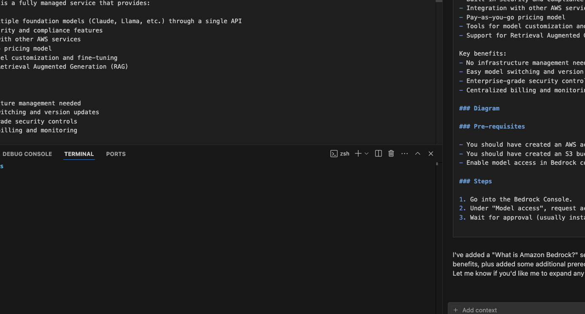

### Background

# H1

## H2

### H3

In my previous video, I showed you how to make a simple chatbot using AWS Bedrock. In this video, we’ll simplify this chatbot functionality.

Instead of using an external database like Pinecone, you can opt to use Amazon OpenSearch Vector database. I’ll let you read into it’s features, but it’s essentially

### What is Amazon Bedrock?

Amazon Bedrock is a fully managed service that provides:

- Access to multiple foundation models (Claude, Llama, etc.) through a single API
- Built-in security and compliance features
- Integration with other AWS services
- Pay-as-you-go pricing model
- Tools for model customization and fine-tuning
- Support for Retrieval Augmented Generation (RAG)

Key benefits:

- No infrastructure management needed
- Easy model switching and version updates
- Enterprise-grade security controls
- Centralized billing and monitoring

### Diagram

### Pre-requisites

- You should have created an AWS account already.
- You should have created an S3 bucket that you have access to. Make it public for easiest use.
- Enable model access in Bedrock console for the models you plan to use

### Steps

1. Go into the Bedrock Console.
2. Under "Model access", request access to the foundation models you want to use
3. Wait for approval (usually instant for most models)
